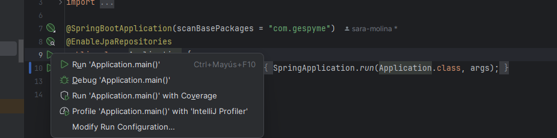

# job-service

Gespyme repository to manage joboperations.

## Deployment
For the deployment of this application, the docker job_database_container should be running. The archive application.yaml of this project is prepared to connect the server automatically with this database.

To deploy the app locally, in the class Application press the triangle and select run Application as it can be seen in the image. This will deploy a Tomcat server.

In the resources folder there is a postman collection that has a test suite with all the possible use cases. [Job-microservice.postman_collection.json](src%2Fmain%2Fresources%2FJob-microservice.postman_collection.json)